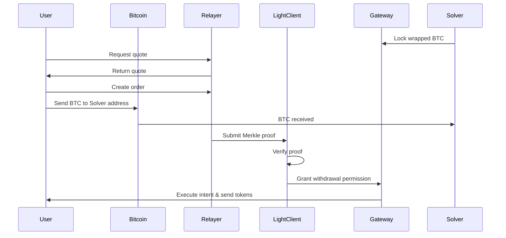
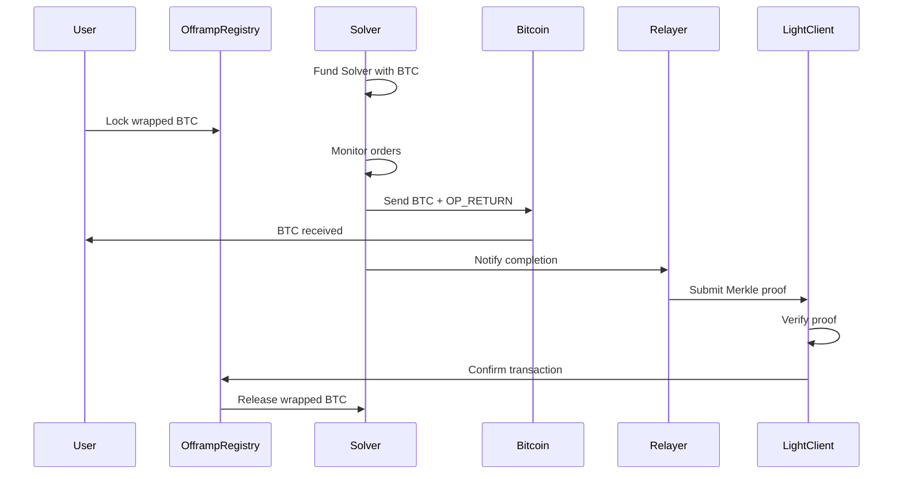

## Overview

BOB Gateway is an intent-based bridge that enables Bitcoin users to access DeFi protocols with a single Bitcoin transaction. The protocol coordinates peer-to-peer swaps between users and liquidity providers (LPs) secured by an on-chain Bitcoin Light Client.

## Onramp: Bitcoin → BOB

<Steps>
  <Step title="Liquidity">
    Solvers hold wrapped Bitcoin on BOB or destination chain.
  </Step>
  
  <Step title="Quote">
    User requests to swap BTC for wrapped BTC or execute a DeFi action (stake, lend, swap). The API provides quotes with routing information, fees, and expected outputs.
  </Step>
  
  <Step title="Order Creation">
    User creates an order with the Relayer to reserve liquidity. The Relayer provides transaction details including the Solver's Bitcoin address and order parameters.
  </Step>
  
  <Step title="Bitcoin Transaction">
    User sends BTC to the given Bitcoin address. The order details are tracked by the Relayer using the transaction ID (txid).
  </Step>
  
  <Step title="Trustless Verification">
    The Relayer verifies the Bitcoin transaction:
    - The transaction exists in a Bitcoin block
    - The block meets the required proof-of-work difficulty
    - The transaction was sent to the correct Solver address with the correct amount
  </Step>
  
  <Step title="Intent Execution">
    After verification, Gateway releases the Solver's wrapped Bitcoin to execute the user's intent:
    - **Direct transfer**: Sends wrapped BTC to user's address
    - **Staking**: Converts to BTC LST/LRT and sends to user
    - **Custom strategy**: Executes smart contract logic
    
    Output tokens are sent to the user's address on the destination chain.
  </Step>
</Steps>

### Architecture Diagram

The onramp process involves trustless coordination between Bitcoin, the Relayer, and BOB:

## Offramp: BOB → Bitcoin

<Steps>
  <Step title="Registration">
    Solvers register their address and fund it with native Bitcoin (BTC) to fulfill offramp orders.
  </Step>
  
  <Step title="User Creates Order">
    User locks wrapped Bitcoin in the `OfframpRegistry` smart contract and specifies their Bitcoin address for receiving BTC.
  </Step>
  
  <Step title="Solver Accepts & Fulfills">
    Solvers monitors open orders, accepts those that meets their fee threshold and broadcasts a Bitcoin transaction to the user's specified address.
  </Step>
  
  <Step title="Proof & Settlement">
    After Bitcoin confirmation, the Relayer submits a Merkle proof of the Bitcoin transaction to the `OfframpRegistry`. The contract verifies the proof and transfers the user's locked wrapped Bitcoin to the LP as reimbursement.
  </Step>
  
  <Step title="Fallback Options">
    If the order isn't fulfilled within a reasonable time:
    - User can bump transaction fees to incentivize Solvers
    - User can unlock their funds after a claim delay period
  </Step>
</Steps>

### Architecture Diagram

<Warning>
Users' funds cannot be stolen by the relayer, but orders may be "stuck" if the relayer is offline since users cannot currently submit proofs themselves.
</Warning>

## Adoption

Track Gateway's current liquidity, volume, and usage on the [BOB Gateway Dune Dashboard](https://dune.com/bob_collective/gateway).

## Next Steps

<CardGroup cols={2}>
  <Card title="Integration Guide" icon="code" href="/gateway/integration">
    Start integrating Gateway into your app
  </Card>
  <Card title="Build Strategies" icon="layer-group" href="/gateway/strategies">
    Create custom DeFi strategies
  </Card>
  <Card title="API Reference" icon="book" href="/api-reference/overview">
    Explore the complete API
  </Card>
  <Card title="Technical Docs" icon="file-lines" href="https://docs.gobob.xyz/docs/gateway/overview">
    Read the full technical documentation
  </Card>
</CardGroup>
